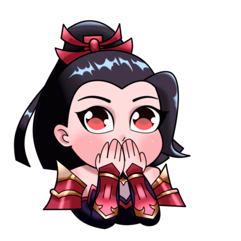

# Erica Joy Mejia's Portfolio

Welcome to my portfolio! This project showcases my skills and projects using the following technologies:

  
  
  
  
  

## About Me

Hi, Erica Here! At the youthful age of 21, I find my heart racing and my spirit soaring whenever I delve into the captivating world of Mobile Legends. As the battleground unfolds before me, I embrace the thrill of competition, the strategic maneuvers, and the camaraderie forged amidst the chaos of battle.

  

## My Favorite Heroes

Among the plethora of heroes that grace the battlefield, three hold a special place in my heart: Hanabi, Nana, and Chang'e.

- **Hanabi**: With her graceful yet lethal prowess, Hanabi embodies the perfect blend of elegance and power. With each arrow she releases, she strikes fear into the hearts of her adversaries, leading her team to glorious victories.

- **Nana**: The adorable yet formidable sorceress charms her foes with her whimsical appearance while unleashing devastating spells that turn the tide of battle. Her ability to control the battlefield with her magical prowess is nothing short of mesmerizing.

- **Chang'e**: The celestial dancer whose graceful movements are matched only by the devastation she rains down upon her enemies. With her mystical powers and unwavering resolve, she embodies the epitome of strength and resilience.

## Contact Me

Feel free to reach out to me via email:

- **rcjymj@gmail.com**

  
  

## License

This project is licensed under the MIT License.

  

## Acknowledgements

- Mobile Legends for the amazing game.
- Netlify for hosting my portfolio.
- Shields.io for the beautiful badges.

---

  Created by <strong>Erica Joy Mejia</strong>

